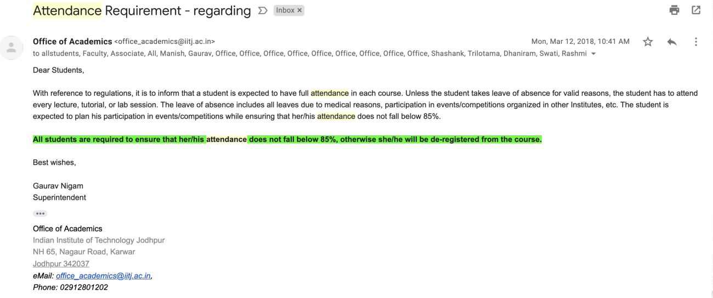

Many engineering colleges in India have compulsory attendance criteria. For some colleges it is 60%, for some, it is 70%. During my graduation, my college had compulsory attendance criteria of 85% and it still exists till date.

Source: My college email account

Can you believe it? This much strict attendance criteria for the so-called elite engineering institution of India. My argument is that compulsory attendance criterion does more evil than good. It kills creativity and hampers the holistic growth of students.

### Teaching standards

The main agenda behind compulsory attendance criteria is to get students to class so that they can study the subjects taught in classrooms. There are several loopholes here. You need good faculty to teach subjects in such a manner that students take interests. Teachers should find ways and means by which studies can be made more interesting. A robust feedback loop needs to be in place.

Compulsory attendance breeds incompetence as faculties are not worried about the number of students attending their class. They can teach in whatever manner they want to and get away with it. The mark of a good teacher is to attract students to the class and keeping them engaged for the entire duration of the lecture.

What happens right now is, if the students don’t take interest in what is being taught, the administration forces them to attend the classes by threatening them with deregistrations from courses.

### Why is it bad

Using punishment to decrease behaviours(here not attending classes) is not working out very well for the wellness of students. Students do attend more classes but only because of fear. The actual passion for studying in class is lost. Anything which is forced upon someone will lose its charm. What is the use of un-interested students in a classroom? This is not education.

Let’s pick an example of my college. IIT Jodhpur [vision](http://iitj.ac.in/institute/index.php?id=vision_and_mission) statement says that it “Prepares needed technical human resources to meet the technology challenges of the nation.”

Can you see the irony here? To solve the technical challenges of the nation, one needs to cultivate a sense of creativity. Creativity refers to the use of imagination or original ideas to create something. To solve problems that were not solved before a person needs some sense of creativity. Creativity can not be forced. It can also not be taught in classes and labs merely.

Students are bound with this huge attendance criteria and not set free. Creativity is something that comes independently and in full freedom. Creativity is killed if not given enough freedom.

### Better horizons

There is a growing trend of freelancing, working part-time, on a project-by-project basis and working from home and this takes focus, dedication and time management — none of which is being inculcated in a higher-education system focused on rote learning and mere presence. Not everything is in classes and labs. Students need to be given the chance to make the best use of their time as per their discretion.

Most colleges in the Western part of the world do not have compulsory attendance, yet because of the quality of the classes, students attend them voluntarily. The classes are interactive. Students are given the freedom to choose their subjects and sometimes even given options in the method of evaluation.

Strict attendance criteria force you to attend classes that you are not interested in. Colleges should focus attention on how much of the knowledge being imparted is willingly taken by students.

---

Thanks for reading. Feel free to connect with me on [twitter](https://twitter.com/whoAbhishekSah) for any conversations in this.
